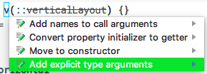
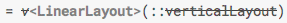

# Splitties View DSL Migration to version 2.0.0-alpha6

**Note on version 2.0.0-alpha5:** This version had was breaking alpha4 API,
but then, a way to "un-break" the API was found, so alpha6 was released to
allow a smoother migration to the changes. Before migrating, please read
this guide, because there's a small important step to perform before
upgrading the dependencies.

## Table of contents

* [Changes in Splitties View DSL 2.0.0-alpha6](#changes-in-splitties-view-dsl-2.0.0-alpha6)
  * [View DSL AppCompat Styles split merged into View DSL AppCompat](#view-dsl-appcompat-styles-split-merged-into-view-dsl-appcompat)
  * [`v` deprecated](#v-deprecated)
  * [Functions designed for old `v` are deprecated too](#functions-designed-for-old-v-are-deprecated-too)
  * [New functions to instantiate views](#new-functions-to-instantiate-views)
    * [New primitives: `view`](#new-primitives-view)
    * [New inline aliases for common views](#new-inline-aliases-for-common-views)
  * [Improved xml compatibility](#improved-xml-compatibility)
    * [Easily include xml layouts](#easily-include-xml-layouts)
    * [Xml styles support](#xml-styles-support)
  * [Improved documentation](#improved-documentation)
* [Migrating from 2.0.0-alpha4 to 2.0.0-alpha6 step by step](#migrating-from-2.0.0-alpha4-to-2.0.0-alpha6-step-by-step)
  * [1. Add explicit type arguments before upgrading to 2.0.0-alpha6](#1.-add-explicit-type-arguments-before-upgrading-to-2.0.0-alpha6)
  * [2. Remove dependencies on removed splits](#2.-remove-dependencies-on-removed-splits)
  * [3. Upgrade the dependencies version and sync gradle](#3.-upgrade-the-dependencies-version-and-sync-gradle)
  * [4. Compile your project to see all the deprecated symbols usage, and replace them](#4.-compile-your-project-to-see-all-the-deprecated-symbols-usage,-and-replace-them)

## Changes in Splitties View DSL 2.0.0-alpha6

### View DSL AppCompat Styles split merged into View DSL AppCompat

The View DSL AppCompat Styles split has been removed.

If you used it, replace it with the standard View DSL AppCompat split which now
includes styles by default.

For reference, here's how it should look like into your gradle dependencies:

```groovy
implementation "com.louiscad.splitties:splitties-viewdsl-appcompat-styles:$splitties_version"
```

### `v` deprecated

Let's start with the "saddest", the deprecations, so we end up on a positive note.

The 3 overloads of `v` for `Context`, `View` and `Ui` have been deprecated in
favor of `view`.

In fact, this is just a renaming, but the old name has been kept for compatibility
so migration is easy and step by step in case you used `v` a lot of places.

Continuing reading the changes, you'll see that you'll be less likely to need
`v`/`view` now as `inline` alternatives delegating to the `view` functions
have been added for even more readable code.

### Functions designed for old `v` are deprecated too

In version 2.0.0-alpha4, in some cases, you would pass a function reference instead of
a constructor reference to `v`.

Here's an example:

```kotlin
val submitBtn = v(::coloredButton) { textResource = R.string.submit }
val contentListView = v(::recyclerView)
```

In version 2.0.0-alpha6, all the functions like `coloredButton` and `recyclerView`
that were designed to be used this way have been deprecated.

They have been replaced with better alternatives.
 
Functions like `coloredButton` that were in the now removed "View DSL AppCompat Styles"
split are still in the same package, but in the "View DSL AppCompat" split, and are
deprecated.

You need to replace them with `AppCompatStyles`, which is a new way xml styles from
AppCompat are supported, with a nicer syntax.
See [here how to use it](README.md#using-appcompat-styles).


### New functions to instantiate views

#### New primitives: `view`

Now that the 3 `v` overloads are deprecated, there 6 new overloads of a function
called `view`.

Why 6? Because there are 2 types of overloads, multiplied by the 3 supported
receivers: `Context`, `View` and `Ui` as usual.

The first overload type is the one you already knew when using `v`, the
parameters are still exactly the same.

The second overload is very similar, but instead of requiring a function taking
a `Context` and returning a `View` as first parameter, it just uses the reified
type parameter (that can be inferred) to instantiate the View, so the following
snippet is valid:
```kotlin
val myBtn: Button = view {
    textResource = R.string.click_me
}
```
The first goal with this second overload is not to have a new syntax, but to
allow instantiation of subclasses when needed.

If you use the View DSL AppCompat additional module, the snippet above
will automatically create an `AppCompatButton` instance, just like the
`LayoutInflater` would automatically do with your xml layout.

This works for all AppCompat widgets, but as a bonus, if you use the
View DSL Design additional module, you'll get instances of the
design support library widgets that have some known bugs fixed!

#### New inline aliases for common views

Let's start this section with an example.

The snippet above can be replaced with this one:
```kotlin
val myBtn = button {
    textResource = R.string.click_me
}
```

That is possible because there are now several functions like `button` that
enable even more readable UI code.

See the list of available functions directly in the (simple) source for:
* Android's [Views](src/main/java/splitties/viewdsl/core/Views.kt)
and [ViewGroups](src/main/java/splitties/viewdsl/core/ViewsGroups.kt).
* AppCompat [Views](../viewdsl-appcompat/src/main/java/splitties/viewdsl/appcompat/AppCompatOnlyViews.kt).
* Design support library [Views](../viewdsl-design/src/main/java/splitties/viewdsl/design/Views.kt)
and [ViewGroups](../viewdsl-design/src/main/java/splitties/viewdsl/design/ViewGroups.kt).
* [ConstraintLayout](../viewdsl-constraintlayout/src/main/java/splitties/viewdsl/constraintlayout/Views.kt).

Note that you can create you own methods similar to these for third party views and
for you custom views.

### Improved xml compatibility

#### Easily include xml layouts

There's `inflate` works just like `view`, with an extra first parameter for the
layout resource id. [Read a bit more here](README.md#inflating-existing-xml-layouts).

#### Xml styles support

Using xml styles with Splitties is now possible, with efficient and clean code.
[Read more here](README.md#using-styles-defined-in-xml).

### Improved documentation

[The documentation of Splitties View DSL](README.md) has been improved in several ways:

- More clarity overall
- New warning for a way you could misuse `lParams` because of missing import.
- Coverage of multiple possibilities brought by the `Ui` interface, like multiplatform
and multi form-factor support.

## Migrating from 2.0.0-alpha4 to 2.0.0-alpha6 step by step

Please follow this guide thoroughly to ensure a smooth migration path.

### 1. Add explicit type arguments before upgrading to 2.0.0-alpha6

With this release, we're getting close to the limits of Kotlin's awesomeness,
unfortunately, not in the best way possible, but there's a solution.

The problem is regarding overload resolution ambiguity. You can avoid this
issue that would break your build after upgrade otherwise, by following the steps
below.

Search for `v(::` in your project using the "Find in path" feature of
Android Studio or IntelliJ IDEA.

For all results that continue with a lowercase letter (`v(::coloredButton)`
matches, but `v(::Button)` doesn't), place the caret immediately after `v`, use
the IDE quick action (<kbd>alt</kbd>/<kbd>⌥ option</kbd> + <kbd>⏎ enter</kbd>)
and select "Add explicit type arguments".



You should now have a warning for unnecessary type argument that you need to ignore for now.



Note that in the two screenshots above, the `verticalLayout` function is struck-through,
but that won't be the case for you as your are doing this on version 2.0.0-alpha4, it will
happen in the next steps though after we upgrade to version 2.0.0-alpha6.

### 2. Remove dependencies on removed splits

Two splits that were present in version 2.0.0-alpha4 have been removed in version
2.0.0-alpha6.

If you had View DSL AppCompat Styles in your dependencies, remove it and make sure
you have View DSL AppCompat in you dependencies (that now includes styles).

In more concrete "words", remove any dependency looking like this:

```groovy
implementation "com.louiscad.splitties:splitties-viewdsl-appcompat-styles:$splitties_version"
```

and make sure you still have a dependency like this:

```groovy
implementation "com.louiscad.splitties:splitties-viewdsl-appcompat:$splitties_version"
```

There has also been a split renaming that you may depend on:

Splitties UI Thread is now Splitties Main Thread.

If you have any dependency looking like this:

```groovy
implementation "com.louiscad.splitties:splitties-uithread:$splitties_version"
```

Edit it so it becomes like this:

```groovy
implementation "com.louiscad.splitties:splitties-mainthread:$splitties_version"
```

In case a dependency depends on the old artifact, you can force it to use the
newest version by adding this into your root project's `build.gradle` file:

```groovy
allprojects {
    ext {
        splitties_version = '2.0.0-alpha6' // You may already have this line with an old version
    }
    configurations.all {
        resolutionStrategy.eachDependency { DependencyResolveDetails details ->
            if (details.requested.name == 'splitties-uithread') {
                details.useTarget group: details.requested.group, name: 'splitties-mainthread', version: splitties_version
                details.because "Splitties uithread has been renamed to mainthread"
            }
        }
    }
}
```

### 3. Upgrade the dependencies version and sync gradle

After making sure you updated the dependencies version from 2.0.0-alpha4 to 2.0.0-alpha6
for all artifacts (hopefully, you use a variable to do it one shot), perform a gradle
sync and wait for it to finish.

In case of gradle sync failure, run a build from command line with the `--stacktrace`
option, so you can see the error, which could be related to a wrong dependency referenced,
and see the previous step, you should then figure out what you forgot or what needs to be
done.

### 4. Compile your project to see all the deprecated symbols usage, and replace them

After you have upgraded to the new version, compile your project.
When the build is completed, you'll be able to see all the warnings from
usage of deprecated symbols from Splitties.

All the deprecated warnings contain information on how to use the replacement.
Some also have a `replaceWith` so you can automatically change it with IDE quick action.

After all this is done, you can read the [new documentation](README.md) if not done yet,
and enjoy the new version!

If you ever encounter a problem related to this update, or have a question, feel
free to open an issue!
